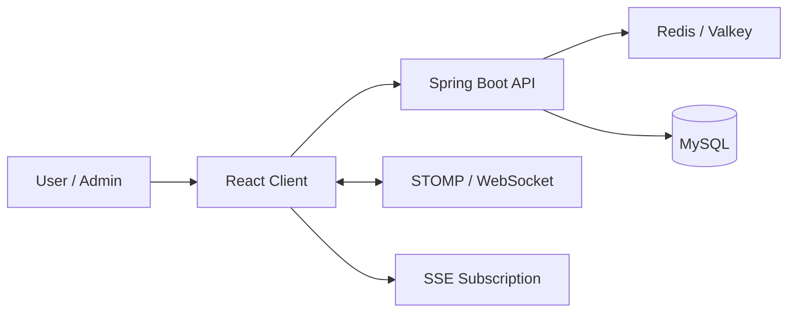

# Project Overview

## 1. 기본 정보

- 프로젝트명: CalmDesk
- 한 줄 소개: 기업용 근태·웰빙·상담·리워드 흐름을 통합한 B2B HR SaaS 프로젝트
- 프로젝트 기간: 2026.01.06 - 2026.02.27
- 개발 형태: 5인 팀 프로젝트
- 저장소 URL: Team GitHub와 개인 fork 기준으로 관리
- 배포 상태: AWS EC2 운영 및 배포 이슈 대응 경험이 있었고, 현재는 보관 문서 중심으로 정리

## 2. 문제 정의

- 콜센터/기업 조직에서는 근태, 스트레스 상태, 상담 신청, 내부 소통, 보상 시스템이 각각 분리되어 관리되기 쉽다.
- 이런 구조에서는 관리자 입장에서 조직 상태를 한 번에 보기 어렵고, 직원 입장에서도 업무/복지 흐름이 하나의 서비스로 이어지지 않는다.
- `CalmDesk`는 이 흐름을 하나의 서비스 안에서 묶되, 단순 화면 구현이 아니라 인증, 실시간 통신, 운영 이슈 대응까지 설명 가능한 프로젝트를 목표로 했다.

## 3. 목표

- 실시간 채팅, 대시보드, 근태, 상담, 보상 흐름을 하나의 서비스 맥락으로 연결한다.
- 관리자 화면에서 조직 상태를 빠르게 파악할 수 있는 데이터 구조를 만든다.
- 포트폴리오 관점에서는 인증 연동, 실시간 통신, 성능 병목 분석, 배포 이슈 대응 경험을 설명 가능한 형태로 정리한다.

## 4. 주요 사용자 그룹

| 사용자 그룹 | 해결하려는 문제 | 주요 사용 장면 | 비고 |
|---|---|---|---|
| 직원 | 근태, 상담, 알림, 포인트 사용 흐름이 흩어져 있는 문제 | 출퇴근, 상담 신청, 알림 확인, 채팅 | 일반 사용자 |
| 관리자 | 팀 상태와 직원 현황을 한 번에 보기 어려운 문제 | 팀원 현황 조회, 대시보드 확인, 승인 처리 | 관리자 화면 비중이 큼 |
| 조직 운영 담당자 | 부서/회사 단위 데이터를 통합적으로 다루기 어려운 문제 | 조직 단위 모니터링, 승인/운영 | 멀티테넌시 구조 설명 포인트 |

## 5. 핵심 기능

| 기능명 | 설명 | 사용자 가치 | 우선순위 |
|---|---|---|---|
| 실시간 채팅 | WebSocket(STOMP) 기반 1:1 / 그룹 채팅 | 조직 내 빠른 소통 | MVP |
| 직원 대시보드 | 개인 업무/정서 지표와 상태를 요약해 표시 | 자신의 상태를 한 화면에서 파악 | MVP |
| 관리자 대시보드 | 팀/회사 단위 현황 조회 및 실시간 갱신 | 조직 상태를 빠르게 확인 | MVP |
| 근태 관리 | 출퇴근, 상태 판별, 관련 후속 갱신 | 직원/관리자 양쪽 흐름 연결 | MVP |
| 상담 기능 | 상담 신청과 관리 흐름 | 고위험군 대응과 상태 관리 | MVP |
| 포인트/기프티콘 | 보상과 마이페이지 연동 | 웰빙 활동과 보상을 연결 | 후속 확장 포함 |

## 6. 범위

### MVP에 포함

- JWT 기반 인증과 보호 API 접근
- 실시간 채팅과 대시보드 갱신
- 관리자 팀/멤버 현황 조회
- 출퇴근 및 관련 상태 반영
- 상담, 알림, 마이페이지 흐름

### 이번 버전에서 제외

| 제외 기능 | 제외 이유 | 추후 검토 시점 |
|---|---|---|
| 풍부한 자동 테스트 자산 | 학원 프로젝트 일정상 구현 우선 비중이 컸음 | 이후 리팩토링 시 |
| 일관된 권한 모델 정리 | 일부 화면은 세션/문자열 비교 기반으로 남아 있음 | 구조 개선 시 |

### 후속 확장 아이디어

- 테스트 보강과 권한 모델 정리
- 배포 구조와 운영 자산 문서화 강화
- 실시간 기능별 채널 분리 기준 정교화

## 7. 핵심 사용자 흐름

1. 사용자가 로그인 후 직원 화면 또는 관리자 화면에 진입한다.
2. 직원은 출퇴근, 채팅, 상담, 알림 확인 등 일상 흐름을 사용한다.
3. 관리자는 팀/멤버 현황과 대시보드를 통해 조직 상태를 확인한다.
4. 상태 변화는 후속 통계 갱신과 실시간 전파로 이어진다.

## 8. 기술 스택

| 영역 | 기술 | 선택 이유 |
|---|---|---|
| Frontend | React 19, React Router DOM, Axios, Zustand, Recharts, Styled Components | 화면 상태와 실시간 UI를 빠르게 구성하기 쉬움 |
| Backend | Java 17, Spring Boot 3.4.5, Spring Security, Spring Data JPA, WebSocket | 인증, 영속성, 실시간 통신을 한 프레임워크 안에서 묶기 쉬움 |
| Database | MySQL, Redis/Valkey | 영속 데이터와 캐시/세션성 데이터를 분리하기 적합 |
| Infra | AWS EC2, Docker, GitHub Actions | 배포 및 운영 이슈를 직접 경험할 수 있는 최소 구조 |
| AI/External | Google Cloud Speech, Spring AI 계열 의존성 | 스트레스/통화 맥락 확장 기능을 다루기 위한 선택 |

## 9. 핵심 설계 선택

### 설계 선택 1

- 선택한 방식: HTTP 요청과 실시간 전파를 분리해 REST + WebSocket + SSE를 함께 사용
- 선택 이유: 요청/응답 API와 실시간 상태 동기화의 성격이 달랐고, 채팅과 알림/대시보드 갱신을 같은 방식으로 처리하는 것보다 역할을 나누는 편이 설명과 운영 모두 유리했다.
- 검토한 대안: 모든 실시간 흐름을 WebSocket 하나로 통일
- 대안을 채택하지 않은 이유: 알림/통계 갱신까지 항상 양방향 채널이 필요하지는 않았다.
- 트레이드오프: 채널 수가 늘어 인증, 예외 처리, 클라이언트 관리 포인트가 증가한다.
- 기대 효과: 기능별로 더 자연스러운 실시간 흐름을 설명할 수 있다.

### 설계 선택 2

- 선택한 방식: 관리자 팀 현황 조회를 벌크 조회 + 메모리 조립으로 최적화
- 선택 이유: 직원별 반복 조회 구조가 실제 운영 병목으로 이어졌고, N+1 제거가 프로젝트에서 가장 설명 가치가 큰 개선 포인트였다.
- 검토한 대안: 기존 반복 조회 유지, 단순 배치 fetch 기대
- 대안을 채택하지 않은 이유: `for`문 내부 직접 Repository 호출 구조에서는 문제가 남았다.
- 트레이드오프: 조회 로직이 다소 복잡해지지만, 읽기 hot path가 명확해진다.
- 기대 효과: 응답 속도 개선과 병목 원인 설명이 모두 가능하다.

## 10. 성공 기준

| 구분 | 기준 |
|---|---|
| 기능 | 실시간 채팅, 대시보드, 근태, 상담, 관리자 현황 조회 흐름이 연결된다. |
| 품질 | 주요 이슈를 원인 기반으로 추적하고, 반복 조회 병목을 구조적으로 개선한다. |
| 배포 | 실제 배포 이슈와 운영 병목을 다뤄본 경험을 남긴다. |
| 문서화 | 회의록/이슈 로그와 별도로 설명 가능한 요약 문서를 남긴다. |

## 11. 면접 / 포트폴리오 포인트

- 포트폴리오에서 강조할 점: 실시간 통신 분리, 인증 연동, 팀 현황 API 최적화, 운영 환경 병목 대응
- 면접에서 설명해야 할 핵심 판단: 왜 WebSocket과 SSE를 분리했는지, 왜 N+1이 인프라 병목으로 이어졌는지
- 솔직하게 말해야 할 한계/미완성 범위: 테스트 자산은 제한적이고, 일부 권한 제어는 더 구조화할 여지가 있다.

## 12. 핵심 흐름 다이어그램

## 13. 미확정 사항

- 운영 환경 구성의 최종 형태와 현재 보관 문서 사이의 차이
- 외부 AI 기능의 최종 적용 범위
- 테스트 보강 우선순위

## Internal Links

- [[Archive/Projects/CalmDesk/CalmDesk]]
- [[Archive/Projects/CalmDesk/Docs/System Architecture]]
- [[Archive/Projects/CalmDesk/Docs/portfolio.internal]]
- [[Archive/Projects/CalmDesk/Log/이슈/백엔드 CD 배포 및 대시보드 성능 최적화]]
