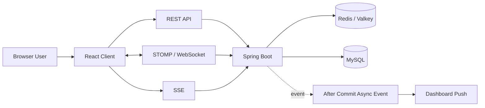

# System Architecture

## 1. 아키텍처 개요

- 시스템 목적: 조직 단위 근태, 상태, 상담, 채팅, 보상 흐름을 한 서비스에서 다루는 B2B HR SaaS 구성
- 클라이언트 종류: React 기반 웹 클라이언트
- 서버 애플리케이션: Spring Boot API
- 데이터 저장소: MySQL
- 캐시 사용 여부: Redis/Valkey 사용
- 파일 저장소: 이 문서에서는 확인된 근거가 부족해 생략
- 외부 연동: Google Cloud Speech, Spring AI 계열 의존성 기반 확장 기능

## 2. 주요 구성요소

| 구성요소 | 기술 | 역할 | 주요 입출력 | 비고 |
|---|---|---|---|---|
| Client | React 19 | 화면 렌더링, API 호출, 실시간 구독 | HTTP, STOMP, SSE | `Frontend/package.json` 기준 |
| API | Spring Boot 3.4.5 | 인증, 도메인 로직, 응답 조립 | REST API | `Backend/build.gradle` 기준 |
| Auth Layer | Spring Security, JWT | HTTP 요청 인증과 보호 API 진입 제어 | JWT | 소켓은 별도 handler 사용 |
| STOMP Handler | Spring Messaging | WebSocket CONNECT 시 JWT 검증 | `Authorization` header | `StompHandler.java` |
| Dashboard Event Layer | Spring Event, `@Async` | 출퇴근 이후 후속 대시보드 갱신 비동기 처리 | Dashboard event | `DashboardEventListener.java` |
| Redis / Valkey | Redis 계열 저장소 | 세션성 데이터/캐시/실시간 보조 저장 | key-value | 로컬 compose에서는 `valkey` 확인 |
| MySQL | 관계형 DB | 영속 데이터 저장 | domain entity data | JPA 기반 |

## 3. 요청 흐름

1. 사용자가 React 화면에서 기능을 실행한다.
2. 프런트엔드는 Axios 기반 HTTP 요청 또는 실시간 채널 연결을 수행한다.
3. HTTP 요청은 Spring Security와 JWT 필터를 지나 API로 진입한다.
4. 채팅 연결은 STOMP `CONNECT` 단계에서 별도 JWT 검증을 거친다.
5. 비즈니스 로직은 필요 시 MySQL과 Redis/Valkey를 사용한다.
6. 상태 변화가 있으면 일부 흐름은 이벤트 기반 후속 갱신으로 이어진다.

## 4. 인증 흐름

- 인증이 필요한 요청의 진입 지점: 보호 API, 실시간 채팅 연결
- 인증 검증 위치:
  - HTTP: Spring Security + JWT 필터
  - STOMP/WebSocket: `StompHandler`
- 권한 검사 위치: 보안 설정과 도메인 로직 조합
- 인증 실패 시 공통 처리:
  - HTTP는 401/403 성격으로 차단
  - STOMP는 연결 단계에서 예외 발생

## 5. 데이터 흐름

### 조회

- 관리자 팀/멤버 조회
  - 먼저 회사 소속 멤버를 읽는다.
  - 멤버 ID 목록 기준으로 휴가, 최신 스트레스, 쿨다운 횟수, 근무 상태를 벌크 조회한다.
  - 응답 DTO는 메모리에서 조립해 반환한다.
- 대시보드 조회
  - 관리자/직원 화면에서 요약 통계 API를 호출한다.
  - 일부 변경은 후속 이벤트를 통해 SSE push로 이어진다.

### 생성 / 수정 / 삭제

- 출퇴근/상태 변화
  - 메인 로직이 성공적으로 커밋된 뒤 대시보드 갱신 이벤트가 발행된다.
- 채팅 메시지
  - 클라이언트가 STOMP 메시지를 보내고 서버가 처리한다.

### 파일 업로드 / 외부 연동

- 현재 조사 범위에서는 핵심 설명 축을 인증, 대시보드, 팀 조회, 실시간 통신에 둔다.
- 외부 AI/STT 연동은 의존성과 README 기준으로 존재하지만, 이번 문서는 핵심 운영 흐름 중심으로 제한한다.

## 6. 성능 / 확장 고려

- 병목 후보:
  - 관리자 팀/멤버 조회의 반복 DB 접근
  - 대시보드 통계 갱신 시 잦은 후속 push
- 캐시 적용 후보:
  - 조직 단위 조회 결과
  - 인증/세션성 데이터
- scale out 지점:
  - 실시간 채널과 관리자 대시보드 조회
- 비동기 처리 후보:
  - 출퇴근 후속 통계 갱신
  - 실시간 push 트리거
- 관측성 메모:
  - 실제 이슈 문서에서 EC2 CPU credit, 응답 지연, K6 결과를 근거로 병목을 설명할 수 있다.

## 7. 외부 연동

| 연동 대상 | 목적 | 실패 영향 | fallback / 비고 |
|---|---|---|---|
| Redis / Valkey | 캐시 및 세션성 데이터 처리 | 일부 기능 응답/상태 동기화 영향 | 로컬 compose 파일 확인 |
| Google Cloud Speech | 음성/스트레스 관련 기능 확장 | 관련 기능 제한 | README 및 의존성 기준 |
| Spring AI 계열 모델 | AI 분석 기능 확장 | 관련 기능 제한 | build 파일 기준 |

## 8. 핵심 아키텍처 판단

### 설계 선택 1

- 선택한 구조: REST API + STOMP/WebSocket + SSE 병행
- 선택 이유: 채팅과 대시보드/알림의 실시간 성격이 달랐다.
- 검토한 대안: 하나의 실시간 채널로 통일
- 대안을 배제한 이유: 모든 이벤트를 양방향 채널로 몰아넣는 것은 과했다.
- 트레이드오프: 인증/예외 처리 포인트가 늘어난다.
- 비용/운영/확장성 영향: 채널별 책임 분리가 가능해지고, 병목과 문제 지점을 설명하기 쉬워진다.

### 설계 선택 2

- 선택한 구조: 팀 현황 응답을 벌크 조회 후 메모리 조립
- 선택 이유: 실제 운영 병목이 반복 조회 구조에서 발생했기 때문이다.
- 검토한 대안: 기존 조회 구조 유지
- 대안을 배제한 이유: 인프라 병목이 해소되지 않았다.
- 트레이드오프: 서비스 로직이 더 복합적으로 보일 수 있다.
- 비용/운영/확장성 영향: hot path의 DB 호출 수를 줄여 운영 안정성에 직접 도움을 줬다.

## 9. 아키텍처 다이어그램

## 10. 면접 / 포트폴리오 포인트

- 왜 이 구성으로 나눴는가: 채팅과 통계/알림의 실시간 성격을 분리하려고 했다.
- 어떤 병목을 예상했는가: 관리자 현황 조회와 후속 통계 갱신
- 운영/비용 측면에서 타협한 부분: 구조는 실시간성을 확보했지만, 테스트와 권한 모델 정리는 제한적이었다.
- 이후 확장 시 바꿔야 할 부분: 권한 정책 일관화, 테스트 보강, 실시간 채널 경계 정리

## 11. 미확정 사항

- 운영 환경 reverse proxy/배포 토폴로지의 최종 문서화 수준
- AI 관련 기능의 실제 최종 적용 범위
- 테스트 전략 보강 계획

## Internal Links

- [[Archive/Projects/CalmDesk/CalmDesk]]
- [[Archive/Projects/CalmDesk/Docs/Project Overview]]
- [[Archive/Projects/CalmDesk/Docs/portfolio.internal]]
- [[Archive/Projects/CalmDesk/Log/이슈/API 403 Forbidden 오류 해결]]
- [[Archive/Projects/CalmDesk/Log/이슈/백엔드 CD 배포 및 대시보드 성능 최적화]]
