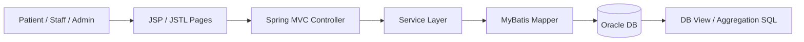

# Project Overview

## 1. 기본 정보

- 프로젝트명: MediFlow
- 한 줄 소개: 병원 예약, 진료, 근태, ERP 운영 흐름을 통합하려는 JSP 기반 병원 ERP 프로젝트
- 프로젝트 기간: 2025.10.23 - 2025.11.19
- 개발 형태: 6인 팀 프로젝트
- 저장소 URL: `W3C-Project`
- 배포 상태: 학원 프로젝트 범위에서 로컬/팀 개발 환경 중심으로 진행

## 2. 문제 정의

- 병원 예약과 운영 데이터가 수기 또는 분산된 방식으로 관리되면 중복 확인과 조율 비용이 커진다.
- 특히 특수 장비 예약, 진료 일정, 직원 근태, ERP 관리가 분리되어 있으면 운영 흐름이 끊긴다.
- `MediFlow`는 예약, 진료, 근태, 직원/환자 관리 흐름을 한 시스템으로 모아 운영 효율을 높이는 것을 목표로 했다.

## 3. 목표

- 병원 예약과 ERP 운영 흐름을 하나의 웹 애플리케이션으로 통합한다.
- DB Lead 관점에서 데이터 무결성과 조회 구조를 직접 설계해 본다.
- 포트폴리오 관점에서는 Oracle, MyBatis, JSP/JSTL, View, `LISTAGG`, 근태 자동화 로직을 설명 가능한 프로젝트로 정리한다.

## 4. 주요 사용자 그룹

| 사용자 그룹 | 해결하려는 문제 | 주요 사용 장면 | 비고 |
|---|---|---|---|
| 환자/회원 | 예약과 조회 흐름이 불편한 문제 | 예약 신청, 내 예약 확인 | 홈페이지 흐름 |
| 병원 직원 | 근태, 환자, 예약 정보를 여러 화면에서 따로 보는 문제 | 근태 확인, ERP 관리 | 내부 사용자 |
| 관리자 | 승인/현황/운영 흐름을 한 번에 보기 어려운 문제 | 승인, 대시보드, 운영 관리 | 세션 기반 관리자 제어 |

## 5. 핵심 기능

| 기능명 | 설명 | 사용자 가치 | 우선순위 |
|---|---|---|---|
| 예약 관리 | 진료/시설 예약 등록, 수정, 취소 | 예약 절차 단순화 | MVP |
| ERP 환자/직원 관리 | 환자, 직원, 예약 상태를 ERP 화면에서 조회 | 운영 정보 통합 | MVP |
| 근태 관리 | 출퇴근, 신청, 승인/반려, 현황 조회 | 인사/운영 흐름 연결 | MVP |
| 진료 기록 조회 | View와 집계 SQL로 환자/진료 기록 조회 | 의료 운영 흐름 통합 | MVP |
| 문의/공지 | 커뮤니티성 기능과 검색/조회 | 운영 커뮤니케이션 보조 | 후속 포함 |

## 6. 범위

### MVP에 포함

- 회원/로그인과 세션 기반 화면 진입
- 병원 예약과 ERP 관리 화면
- 근태 신청 및 승인/반려
- 환자/직원/진료 관련 조회
- Oracle 기반 DB 설계와 MyBatis SQL 매핑

### 이번 버전에서 제외

| 제외 기능 | 제외 이유 | 추후 검토 시점 |
|---|---|---|
| 풍부한 자동 테스트 자산 | 학원 프로젝트 일정상 구현과 화면 완성 비중이 컸음 | 이후 리팩토링 시 |
| 일관된 권한 모델 정리 | 일부 관리자 판별과 화면 제어가 단순 구현에 머뭄 | 구조 개선 시 |

### 후속 확장 아이디어

- 권한 정책 구조화
- 컨트롤러 비즈니스 로직 정리
- AJAX 기반 화면 개선

## 7. 핵심 사용자 흐름

1. 사용자가 로그인해 홈페이지 또는 ERP 화면으로 진입한다.
2. 예약/조회/근태/ERP 관리 흐름을 각각 화면에서 수행한다.
3. 서비스 계층이 필요한 비즈니스 로직을 수행한다.
4. MyBatis Mapper가 Oracle SQL과 View를 통해 데이터를 조회/갱신한다.

## 8. 기술 스택

| 영역 | 기술 | 선택 이유 |
|---|---|---|
| Frontend/View | JSP, JSTL, JavaScript, jQuery | 서버 렌더링 화면과 빠른 화면 조합에 적합 |
| Backend | Java 17, Spring Boot 3.5.7, MVC | Controller/Service/Mapper 구조를 학습하고 적용하기 쉬움 |
| Database | Oracle, MyBatis | SQL과 스키마를 직접 설계/제어하기 적합 |
| Packaging | WAR, Tomcat | JSP 기반 애플리케이션 배포 구조에 맞음 |

## 9. 핵심 설계 선택

### 설계 선택 1

- 선택한 방식: DB 설계를 먼저 잡고 제약조건과 View를 적극 활용
- 선택 이유: 병원 업무 데이터는 테이블 관계와 상태값 정합성이 중요했고, DB Lead 역할과도 직접 연결됐다.
- 검토한 대안: 애플리케이션 로직에서만 정합성 보장
- 대안을 채택하지 않은 이유: 팀 협업 중 상태값과 참조관계가 쉽게 흔들릴 수 있었다.
- 트레이드오프: 초기 설계와 실제 화면 요구가 달라질 때 스키마 조정 비용이 생긴다.
- 기대 효과: 데이터 무결성과 SQL 설명력이 높아진다.

### 설계 선택 2

- 선택한 방식: JSP + 세션 기반 화면 흐름과 MyBatis SQL 중심 구조 유지
- 선택 이유: 학원 프로젝트 범위에서 화면 구현과 DB 제어를 동시에 빠르게 진행하기 좋았다.
- 검토한 대안: 더 무거운 프런트엔드 구조 도입
- 대안을 채택하지 않은 이유: 기간 대비 구조 복잡도가 과했다.
- 트레이드오프: 권한 체크와 화면 분기가 컨트롤러/JSP로 퍼질 수 있다.
- 기대 효과: 예약, 근태, ERP 흐름을 짧은 기간 안에 끝까지 연결할 수 있다.

## 10. 성공 기준

| 구분 | 기준 |
|---|---|
| 기능 | 예약, 진료, 근태, ERP 조회 흐름이 실제로 연결된다. |
| 품질 | DB 무결성 기준과 조회 SQL을 설명 가능하게 남긴다. |
| 배포 | 학원 프로젝트 범위에서 실행 가능한 형태를 유지한다. |
| 문서화 | README/회고/코드에 흩어진 정보를 프로젝트 문서로 다시 정리한다. |

## 11. 면접 / 포트폴리오 포인트

- 포트폴리오에서 강조할 점: DB Lead 역할, Oracle View/`LISTAGG`, 근태 자동화, MyBatis 기반 SQL 설계
- 면접에서 설명해야 할 핵심 판단: 왜 View와 제약조건을 적극 활용했는지, 근태 상태를 어떻게 계산했는지
- 솔직하게 말해야 할 한계/미완성 범위: 테스트는 제한적이고, 권한 구조와 컨트롤러 분리는 더 다듬을 여지가 있다.

## 12. 핵심 흐름 다이어그램

## 13. 미확정 사항

- 권한 모델을 어디까지 구조화할지
- 컨트롤러에 남아 있는 비즈니스 로직의 정리 범위
- 테스트 보강 우선순위

## Internal Links

- [[Archive/Projects/MediFlow/MediFlow]]
- [[Archive/Projects/MediFlow/Docs/System Architecture]]
- [[Archive/Projects/MediFlow/Docs/portfolio.internal]]
- [[Archive/Projects/MediFlow/Log/세미 프로젝트 피드백]]
