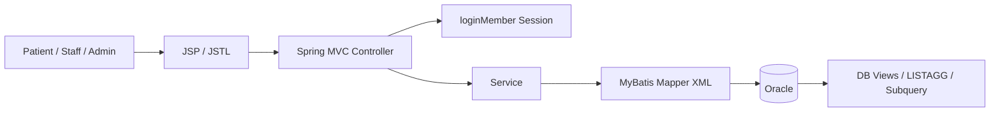

# System Architecture

## 1. 아키텍처 개요

- 시스템 목적: 예약, 진료, 근태, ERP 운영 흐름을 하나의 웹 애플리케이션에서 다룬다.
- 클라이언트 종류: JSP/JSTL 기반 웹 화면과 일부 JavaScript 상호작용
- 서버 애플리케이션: Spring Boot MVC 애플리케이션
- 데이터 저장소: Oracle
- 캐시 사용 여부: 현재 조사 범위에서는 별도 캐시 확인 없음
- 파일 저장소: 별도 확인 없음
- 외부 연동: 현재 조사 범위에서는 핵심 설명 축을 Oracle/MyBatis 기반 내부 흐름에 둔다.

## 2. 주요 구성요소

| 구성요소 | 기술 | 역할 | 주요 입출력 | 비고 |
|---|---|---|---|---|
| Browser View | JSP, JSTL, JS, jQuery | 화면 렌더링과 사용자 입력 처리 | HTTP 요청 | 서버 렌더링 중심 |
| MVC Controller | Spring MVC | 세션 확인, 요청 분기, 모델 전달 | View name, redirect | 일부 로직이 컨트롤러에 남아 있음 |
| Service Layer | Java Service | 근태, 예약, 진료, ERP 비즈니스 로직 | VO, Map | `AttendanceServiceImpl`, `ReservationServiceImpl` 등 |
| MyBatis Mapper | MyBatis XML | SQL 실행과 VO 매핑 | Oracle SQL | View와 집계 SQL 활용 |
| Oracle DB | Oracle | 영속 데이터 저장 | tables, views | 핵심 source of truth |
| Session | `loginMember` 세션 | 로그인 상태와 화면 진입 제어 | session attribute | 완전한 RBAC는 아님 |

## 3. 요청 흐름

1. 사용자가 JSP 화면에서 예약, 근태, ERP 기능을 실행한다.
2. 컨트롤러가 `loginMember` 세션을 확인하고 필요한 요청을 서비스로 전달한다.
3. 서비스는 입력을 조립하고 비즈니스 규칙을 적용한다.
4. MyBatis Mapper가 Oracle SQL 또는 View를 사용해 데이터를 읽거나 쓴다.
5. 결과는 VO/Model 형태로 다시 JSP 화면에 전달된다.

## 4. 인증 흐름

- 인증이 필요한 요청의 진입 지점: 회원 전용 페이지, ERP 화면, 근태/예약 변경 요청
- 인증 검증 위치: 컨트롤러의 `loginMember` 세션 확인
- 권한 검사 위치:
  - 일부 화면은 세션/아이디 조건문 기반 제어
  - 예: 근태 화면의 관리자 탭 제어
- 인증 실패 시 공통 처리: 로그인 페이지로 redirect하거나 요청을 차단

## 5. 데이터 흐름

### 조회

- 근태 메인 화면
  - 오늘 기록, 이력, 신청 목록, 관리자 승인 목록을 서비스에서 조합한다.
- 전체 근태 현황
  - `attendance-mapper.xml`에서 View와 `LISTAGG`를 사용해 직원별 스케줄과 상태를 한 번에 조회한다.
- 진료 기록 조회
  - `treatmentMapper.xml`에서 View와 `LISTAGG`를 이용해 환자/오더/진단 정보를 묶어 보여준다.
- 예약 가능 시간 조회
  - 진료과/날짜 기준 근무 의사와 예약 수를 계산해 시간대별 가능 여부를 만든다.

### 생성 / 수정 / 삭제

- 출근/퇴근
  - 현재 시간과 스케줄 시간을 비교해 상태를 산정한 뒤 `ABSENCE`에 반영한다.
- 신청 승인/반려
  - 관리자 흐름에서 신청 상태를 수정한다.
- 예약 등록/수정/취소
  - 예약 시간 유효성을 먼저 검사한 뒤 DB에 반영한다.

### 파일 업로드 / 외부 연동

- 현재 조사 범위에서는 파일 업로드/외부 API보다 내부 DB 설계와 SQL 흐름이 핵심이다.

## 6. 성능 / 확장 고려

- 병목 후보:
  - 조인이 많은 ERP 조회
  - 근태/진료 집계 SQL
- 캐시 적용 후보:
  - 현재 확인된 범위에서는 별도 캐시 없음
- scale out 지점:
  - ERP 조회 화면과 예약 관리
- 비동기 처리 후보:
  - 현재 구조는 주로 동기 처리 중심
- 관측성 메모:
  - 자동화된 운영 관측 자산보다는 SQL 구조 자체를 단순화하는 방향으로 접근했다.

## 7. 외부 연동

| 연동 대상 | 목적 | 실패 영향 | fallback / 비고 |
|---|---|---|---|
| Oracle DB | 핵심 업무 데이터 저장 | 시스템 핵심 기능 전체 영향 | 필수 저장소 |
| Tomcat / WAR 실행 환경 | JSP 기반 화면 제공 | 웹앱 실행 불가 | `pom.xml` 기준 |

## 8. 핵심 아키텍처 판단

### 설계 선택 1

- 선택한 구조: JSP/JSTL + Spring MVC + MyBatis + Oracle
- 선택 이유: 화면 구현과 SQL 제어를 짧은 일정 안에 끝까지 연결하기 좋았다.
- 검토한 대안: 더 복잡한 프런트엔드 구조 도입
- 대안을 배제한 이유: 프로젝트 범위와 일정 대비 효율이 낮았다.
- 트레이드오프: 권한/상태 분기가 화면과 컨트롤러에 퍼질 수 있다.
- 비용/운영/확장성 영향: 구조는 단순하지만, 이후 리팩토링 포인트가 명확히 남는다.

### 설계 선택 2

- 선택한 구조: View와 집계 SQL로 반복 조인/표현 로직을 DB 측에서 정리
- 선택 이유: 병원 업무 데이터는 조인이 많아지고, 화면별로 반복 SQL이 생기기 쉬웠다.
- 검토한 대안: 모든 조인을 각 기능 SQL에서 반복
- 대안을 배제한 이유: 쿼리 가독성과 재사용성이 떨어졌다.
- 트레이드오프: DB View에 대한 이해와 관리가 필요하다.
- 비용/운영/확장성 영향: SQL 복잡도를 줄이고 설명 포인트를 명확히 만들 수 있다.

## 9. 아키텍처 다이어그램

## 10. 면접 / 포트폴리오 포인트

- 왜 이 구성으로 나눴는가: 학원 프로젝트 범위에서 서버 렌더링과 SQL 제어를 빠르게 연결하기 위해서
- 어떤 병목을 예상했는가: 조인이 많은 ERP 조회와 상태값 관리 복잡도
- 운영/비용 측면에서 타협한 부분: 권한 체크와 일부 로직이 화면/컨트롤러에 남았다.
- 이후 확장 시 바꿔야 할 부분: 역할 기반 권한 정리, 컨트롤러 슬림화, 테스트 보강

## 11. 미확정 사항

- 관리자 권한 판별 로직의 구조 개선 방향
- DB View 의존도를 어디까지 유지할지
- 비동기/AJAX 전환 우선순위

## Internal Links

- [[Archive/Projects/MediFlow/MediFlow]]
- [[Archive/Projects/MediFlow/Docs/Project Overview]]
- [[Archive/Projects/MediFlow/Docs/portfolio.internal]]
- [[Archive/Projects/MediFlow/Log/세미 프로젝트 피드백]]
