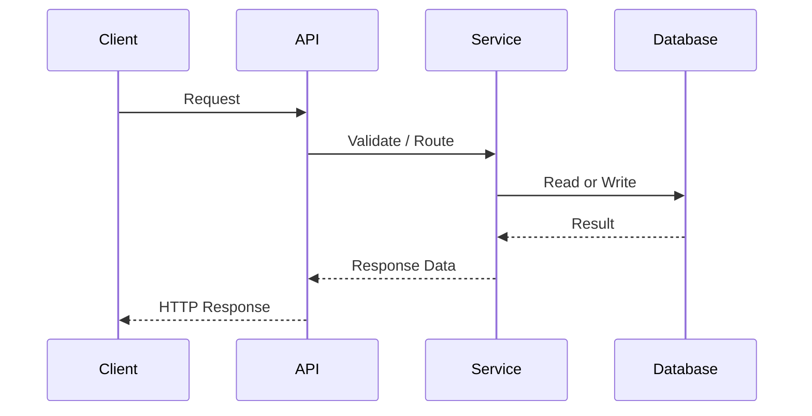

# API 명세서

## 1. API 기본 규칙
- Base URL:
- 인증 방식:
- Content-Type:
- 응답 래핑 규칙:
- 시간/날짜 형식:
- 페이징 규칙:
- 정렬 규칙:
- 에러 코드 네이밍 규칙:

## 2. API 설계 원칙
- RESTful 자원 기준:
- 읽기/쓰기 분리 기준:
- 멱등성 기준:
- 상태 코드 사용 기준:
- 공통 응답 구조 사용 이유:

## 3. 공통 에러 정책
| HTTP Status | 코드 | 의미 | 프론트 처리 |
|---|---|---|---|
| 400 |  | 잘못된 요청 |  |
| 401 |  | 인증 실패 |  |
| 403 |  | 권한 부족 |  |
| 404 |  | 리소스 없음 |  |
| 409 |  | 상태 충돌 |  |
| 500 |  | 서버 오류 |  |

## 4. 엔드포인트 템플릿
### [API 이름]
- 기능명:
- METHOD:
- URL:
- 설명:
- 호출 화면/기능:
- 인증 필요 여부:
- 요구 권한/소유권 조건:

#### Request
##### Path Variable
| 이름 | 타입 | 필수 | 설명 |
|---|---|---|---|
|  |  | Y / N |  |

##### Query Parameter
| 이름 | 타입 | 필수 | 설명 | 예시 |
|---|---|---|---|---|
|  |  | Y / N |  |  |

##### Headers
| 이름 | 필수 | 설명 |
|---|---|---|
|  | Y / N |  |

##### Request Body
```json
{
}
```

##### Validation
- 
- 

#### Response
##### Success
- Status:

```json
{
}
```

##### Error
| Status | 코드 | 발생 조건 | 비고 |
|---|---|---|---|
|  |  |  |  |

#### 설계 판단
- 이 API 구조를 선택한 이유:
- 검토한 대안:
- 대안을 배제한 이유:
- 트레이드오프:
- 멱등성:
- 부작용:
- 비동기 처리 여부:
- 연관 DB/외부 연동:

## 5. 요청 흐름 다이어그램(선택)
> 복잡한 요청, 비동기 처리, 외부 연동이 있을 때만 추가한다.



## 6. 면접 / 포트폴리오 포인트
- 이 API에서 설명할 설계 판단:
- 상태 코드 선택 근거:
- 응답 구조를 이렇게 통일한 이유:

## 7. 미확정 사항
- 
- 
