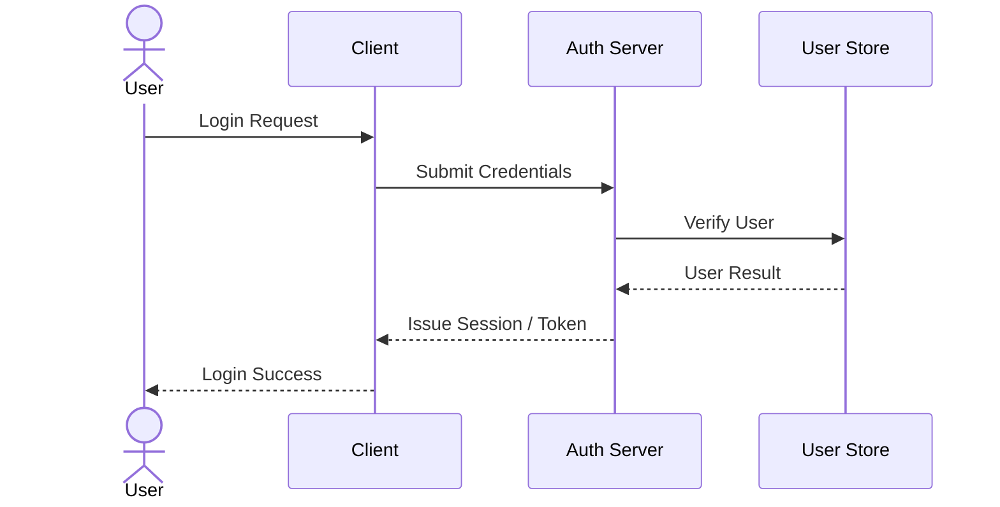
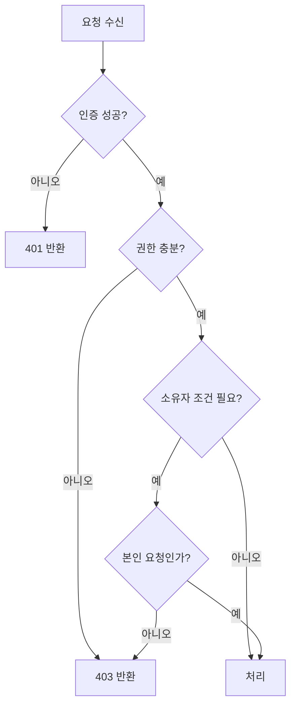

# 인증 / 인가 설계서

## 1. 적용 범위
- 인증 적용 여부:
- 로그인 방식:
- 인증 수단(JWT / Session / OAuth / 기타):
- Access Token 사용 여부:
- Refresh Token 사용 여부:
- 토큰/세션 저장 위치:
- 인증이 필요 없는 공개 범위:

## 2. 사용자 역할
| 역할명 | 설명 | 대표 권한 | 생성/부여 주체 |
|---|---|---|---|
|  |  |  |  |

## 3. 권한 정책
| 리소스/기능 | 비회원 | [ROLE_USER] | [ROLE_ADMIN] | 소유자 조건/비고 |
|---|---|---|---|---|
|  | 가능 / 불가 | 가능 / 불가 | 가능 / 불가 |  |

## 4. 인증 흐름
1. 사용자가 인증 수단을 제출한다.
2. 서버가 사용자 식별과 자격 증명을 검증한다.
3. 성공 시 토큰 또는 세션을 발급한다.
4. 클라이언트가 인증 상태를 저장한다.
5. 이후 보호 리소스 요청마다 인증 정보를 포함한다.

## 5. 인가 흐름
1. 보호 리소스 요청 여부를 확인한다.
2. 인증 성공 여부를 확인한다.
3. 역할 기반 권한을 확인한다.
4. 필요한 경우 리소스 소유자 조건을 확인한다.
5. 비즈니스 규칙을 통과하면 요청을 처리한다.

## 6. 토큰 / 세션 / 보안 정책
- 만료 시간:
- 재발급 조건:
- 비밀번호 암호화 방식:
- Cookie 보안 옵션:
- CSRF 대응:
- CORS 허용 범위:
- 로그아웃/강제 만료 정책:
- 감사 로그 여부:

## 7. 핵심 설계 판단
### 설계 선택 1
- 선택한 방식:
- 선택 이유:
- 검토한 대안:
- 대안을 배제한 이유:
- 트레이드오프:
- 보안상 영향:

### 설계 선택 2
- 선택한 방식:
- 선택 이유:
- 검토한 대안:
- 대안을 배제한 이유:
- 트레이드오프:
- 보안상 영향:

## 8. 예외 처리 정책
| 상황 | HTTP Status | 백엔드 처리 | 프론트 처리 |
|---|---|---|---|
| 인증 정보 없음 | 401 |  |  |
| 인증 정보 만료 | 401 |  |  |
| 권한 부족 | 403 |  |  |
| 소유자 조건 불일치 | 403 |  |  |

## 9. 프론트 처리 규칙
- 보호 라우트 처리:
- 401 처리:
- 403 처리:
- 로그인 성공 후 이동:
- 재로그인/재발급 UX:

## 10. 인증/인가 다이어그램(권장)
### 로그인 시퀀스

### 인가 분기

## 11. 면접 / 포트폴리오 포인트
- 왜 이 인증 방식을 선택했는가:
- 토큰 저장 위치 선택 이유:
- 세션/OAuth를 바로 쓰지 않은 이유:
- 보안 리스크와 한계:

## 12. 미확정 사항
- 
- 
