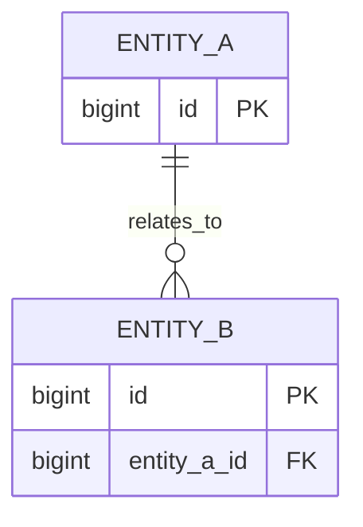

# DB 설계서

## 1. 설계 개요
- DBMS:
- Charset / Collation:
- ORM 또는 SQL 접근 방식:
- Migration 도구:
- Naming Convention:
- 시간 컬럼 정책:
- soft delete 사용 여부:

## 2. 엔티티 / 테이블 목록
| 테이블명 | 관련 도메인 | 목적 | 비고 |
|---|---|---|---|
|  |  |  |  |

## 3. 관계 요약
- 1:N 관계:
- N:M 관계:
- 집계 루트:
- 조회 전용 모델/별도 테이블 여부:

## 4. 핵심 설계 판단
### 설계 선택 1
- 선택한 구조:
- 선택 이유:
- 검토한 대안:
- 대안을 배제한 이유:
- 트레이드오프:
- 성능/유지보수 영향:

### 설계 선택 2
- 선택한 구조:
- 선택 이유:
- 검토한 대안:
- 대안을 배제한 이유:
- 트레이드오프:
- 성능/유지보수 영향:

## 5. 테이블 정의 템플릿
### 테이블명: [table_name]
- 목적:
- 관련 도메인:
- 설명:

| 컬럼명 | 타입 | NULL | PK | UK | FK | 기본값 | 설명 |
|---|---|---|---|---|---|---|---|
|  |  | Y / N | Y / N | Y / N | Y / N |  |  |

#### 인덱스
| 인덱스명 | 컬럼 | 목적 |
|---|---|---|
|  |  |  |

#### 제약 / 비즈니스 규칙
- 
- 

#### 참조 관계
- 

#### 비고
- 

## 6. 제약조건 정책
- FK 유지 전략:
- Unique 대상:
- 길이 제한 기준:
- 값 검증 기준:

## 7. 삭제 / 보관 정책
- 삭제 방식:
- soft delete 적용 테이블:
- cascade 여부:
- 데이터 보관 기간:

## 8. 성능 고려
- 자주 조회되는 컬럼:
- 페이징 기준 컬럼:
- 복합 인덱스 후보:
- N+1 위험 관계:
- 집계/통계 쿼리 주의점:

## 9. ERD 다이어그램(권장)
> DB 설계서는 관계 구조 설명이 핵심이므로 Mermaid 또는 ERD 이미지를 남기는 편이 좋다.

- ERD 이미지/링크:

## 10. 면접 / 포트폴리오 포인트
- 이 DB 구조에서 설명해야 할 핵심 판단:
- 정규화/비정규화 판단:
- 인덱스 설계 이유:
- 트래픽 증가 시 병목 후보:

## 11. 미확정 사항
- 
- 
