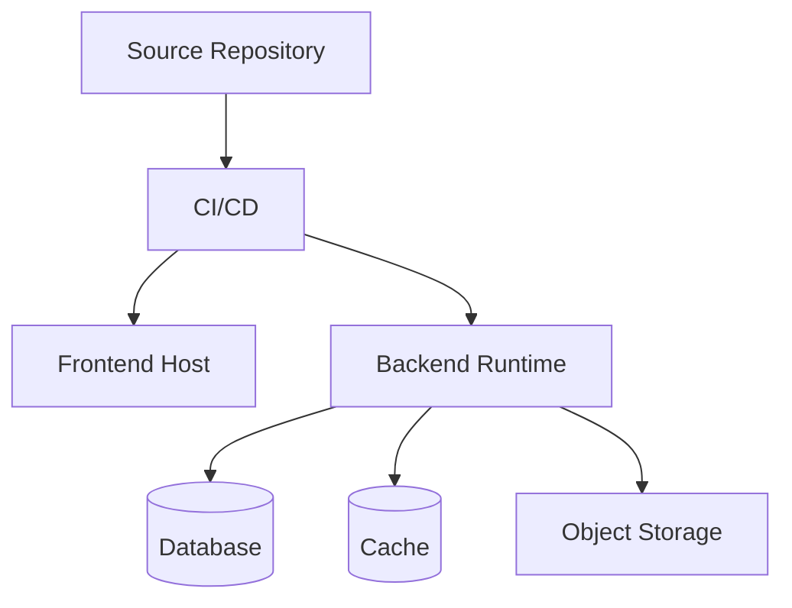
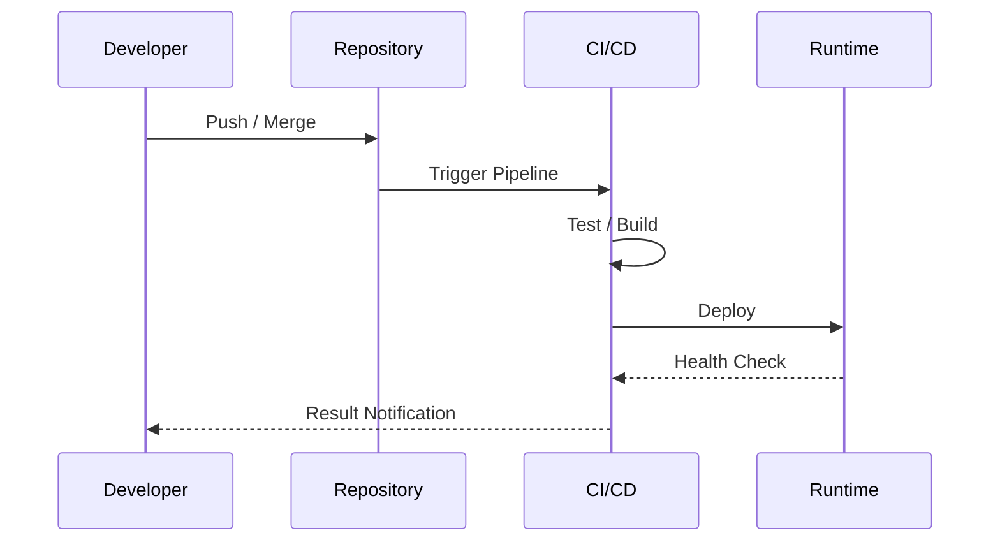

# 배포 / 인프라 설계서

## 1. 배포 개요
- 대상 환경: local / dev / staging / prod
- 운영/테스트 구분:
- 배포 트리거:
- 배포 방식:
- 무중단 배포 여부:
- 롤백 방식:

## 2. 인프라 구성
> AWS 기준이라면 S3, CloudFront, EC2, ECS, RDS, Route 53, ACM 같은 서비스 조합을 적는다.
> 사용하지 않는 영역은 비워 두지 말고 "미사용"이라고 적는다.

| 영역 | 사용 서비스 | 역할 | 공개/비공개 | 비고 |
|---|---|---|---|---|
| Frontend |  |  | Public / Private |  |
| Backend |  |  | Public / Private |  |
| Database |  |  | Public / Private |  |
| Cache |  |  | Public / Private |  |
| Storage |  |  | Public / Private |  |
| DNS / TLS |  |  | Public / Private |  |
| CI/CD |  |  | Public / Private |  |

## 3. 서버 구성
- Frontend 배포 위치:
- Backend 실행 방식:
- Reverse Proxy / Nginx 역할:
- Container / Process Manager:
- Health Check URL:
- 로그 저장 위치:

## 4. 환경 변수 / 비밀값 관리
| 항목 | 사용 주체 | 저장 위치 | 회전/갱신 메모 |
|---|---|---|---|
|  |  |  |  |

## 5. CI/CD 파이프라인
1. 코드 푸시 또는 merge 발생
2. 테스트 및 정적 검사 수행
3. 빌드 산출물 또는 이미지 생성
4. 대상 환경 배포
5. 헬스체크 및 결과 확인
6. 실패 시 알림 또는 롤백

## 6. 도메인 / 네트워크
- 프론트 도메인:
- API 도메인:
- API Prefix:
- CORS 허용 Origin:
- HTTPS 적용 여부:
- 포트 구성:
- 보안 그룹 / 방화벽 메모:

## 7. 운영 고려사항
- 백업 정책:
- 모니터링 도구:
- 알림 채널:
- 로그 보관 정책:
- 비용 최적화 포인트:
- 수동 운영 작업:

## 8. 핵심 배포 / 인프라 판단
### 설계 선택 1
- 선택한 방식:
- 선택 이유:
- 검토한 대안:
- 대안을 배제한 이유:
- 트레이드오프:
- 운영상 영향:

### 설계 선택 2
- 선택한 방식:
- 선택 이유:
- 검토한 대안:
- 대안을 배제한 이유:
- 트레이드오프:
- 운영상 영향:

## 9. 장애 대응 초안
| 증상 | 1차 확인 포인트 | fallback / 롤백 | 담당자 / 비고 |
|---|---|---|---|
|  |  |  |  |

## 10. 배포 다이어그램(권장)
### 배포 구조도

### 배포 파이프라인

## 11. 면접 / 포트폴리오 포인트
- 왜 이 배포 구조를 선택했는가:
- 비용 때문에 타협한 부분:
- 운영상 리스크:
- 나중에 개선할 배포 포인트:

## 12. 미확정 사항
- 
- 
