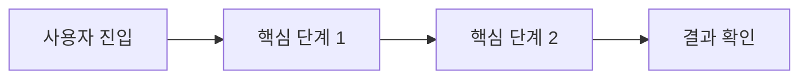

# 프로젝트 개요서

## 1. 기본 정보
- 프로젝트명:
- 한 줄 소개:
- 프로젝트 기간:
- 개발 형태: 개인 / 팀
- 저장소 URL:
- 서비스 URL:
- 배포 상태:

## 2. 문제 정의
- 해결하려는 문제:
- 현재 방식의 한계:
- 이 프로젝트가 필요한 이유:

## 3. 목표
- 사용자 가치:
- 개발 목표:
- 포트폴리오에서 증명하려는 역량:

## 4. 주요 사용자 그룹
| 사용자 그룹 | 해결하려는 문제 | 주요 사용 장면 | 비고 |
|---|---|---|---|
|  |  |  |  |

## 5. 핵심 기능
| 기능명 | 설명 | 사용자 가치 | 우선순위 |
|---|---|---|---|
|  |  |  | MVP / 후속 |

## 6. 범위

### MVP에 포함
- 
- 
- 

### 이번 버전에서 제외
| 제외 기능 | 제외 이유 | 추후 검토 시점 |
|---|---|---|
|  |  |  |

### 후속 확장 아이디어(선택)
- 
- 

## 7. 핵심 사용자 흐름
1. 
2. 
3. 
4. 

## 8. 기술 스택
> 이 문서에서는 “왜 이 기술을 선택했는가”를 적는다.
> 런타임 연결 구조와 구성요소 관계는 `시스템 아키텍처.md`에서 다룬다.

| 영역 | 기술 | 선택 이유 |
|---|---|---|
| Frontend |  |  |
| Backend |  |  |
| Database |  |  |
| Infra |  |  |
| CI/CD |  |  |

## 9. 핵심 설계 선택
### 설계 선택 1
- 선택한 방식:
- 선택 이유:
- 검토한 대안:
- 대안을 채택하지 않은 이유:
- 트레이드오프:
- 기대 효과:

### 설계 선택 2
- 선택한 방식:
- 선택 이유:
- 검토한 대안:
- 대안을 채택하지 않은 이유:
- 트레이드오프:
- 기대 효과:

## 10. 성공 기준
| 구분 | 기준 |
|---|---|
| 기능 |  |
| 품질 |  |
| 배포 |  |
| 문서화 |  |

## 11. 면접 / 포트폴리오 포인트
- 포트폴리오에서 강조할 점:
- 면접에서 설명해야 할 핵심 판단:
- 솔직하게 말해야 할 한계/미완성 범위:

## 12. 핵심 흐름 다이어그램(선택)
> 핵심 사용자 흐름이 길거나, 면접/포트폴리오 설명에 필요할 때 Mermaid로 정리한다.

## 13. 미확정 사항
- 
- 
