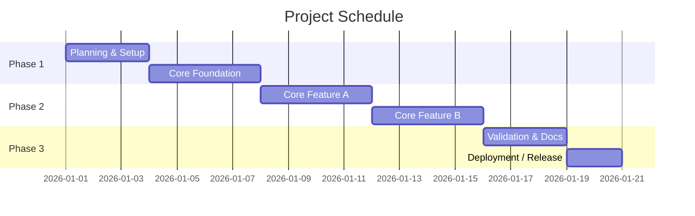

# 일정표

## 1. 기본 정보
- 프로젝트명:
- 시작일:
- 목표 종료일:
- 일정 단위: 주차 / 스프린트 / 마일스톤
- 운영 형태: 개인 / 팀
- 현재 상태: 예정 / 진행 중 / 조정 중 / 완료

## 2. 범위 연결
> 상세 범위와 MVP 정의는 `Project Overview.md`에서 관리한다.
> 이 문서에는 "언제, 어떤 순서로, 어떤 완료 기준으로 진행할지"만 적는다.

- 이번 일정의 MVP 범위:
- 이번 일정에서 제외한 범위:
- 후속 단계로 미룬 범위:
- 일정 산정 기준:

## 3. 일정 운영 규칙
- 갱신 주기:
- 상태 표기 규칙:
  - 예정:
  - 진행 중:
  - 완료:
  - 지연:
- 실제 완료 기준:
- 지연 시 조정 원칙:
- 버퍼 사용 원칙:

## 4. 진행 상태 요약
| 단계 | 기간 | 핵심 목표 | 상태 | 비고 |
|---|---|---|---|---|
| Phase 1 |  |  | 예정 / 진행 중 / 완료 / 지연 |  |
| Phase 2 |  |  | 예정 / 진행 중 / 완료 / 지연 |  |
| Phase 3 |  |  | 예정 / 진행 중 / 완료 / 지연 |  |

## 5. 일정 로드맵
> Mermaid `gantt`는 일정 전체를 한눈에 보여주기 위한 기본 도식이다.
> 아래 골격은 날짜, 단계명, 작업명만 프로젝트 기준으로 수정한다.

## 6. 단계별 계획
### [Phase / Sprint / Week 이름]
- 기간:
- 목표:
- 선행 조건:
- 완료 기준:
- 주요 리스크:
- 관련 설계 문서:

#### 체크리스트
- [ ] 준비 작업
- [ ] 핵심 구현
- [ ] 테스트 / 검증
- [ ] 문서화
- [ ] 버퍼 / 조정

#### 메모
- 

### [다음 단계 이름]
- 기간:
- 목표:
- 선행 조건:
- 완료 기준:
- 주요 리스크:
- 관련 설계 문서:

#### 체크리스트
- [ ] 준비 작업
- [ ] 핵심 구현
- [ ] 테스트 / 검증
- [ ] 문서화
- [ ] 버퍼 / 조정

#### 메모
- 

## 7. 우선순위 조정 기록 (선택)
| 날짜 | 조정 내용 | 이유 | 영향 범위 |
|---|---|---|---|
|  |  |  |  |

## 8. 의존성 / Blocker (선택)
| 항목  | 막는 이유 | 해소 조건 | 비고  |     |
| --- | ----- | ----- | --- | --- |
|     |       |       |     |     |

## 9. 일정 점검 체크리스트
- [ ] MVP 범위와 일정 단계가 연결되어 있다
- [ ] 각 단계에 완료 기준이 있다
- [ ] 테스트 / 검증 작업이 포함되어 있다
- [ ] 문서화 작업이 포함되어 있다
- [ ] 배포 또는 최종 검증 단계가 포함되어 있다
- [ ] 지연 시 조정 원칙이 정리되어 있다

## 10. 미확정 사항
- 
- 
