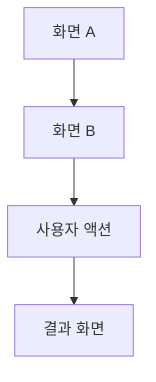

# 화면 설계서

## 페이지 정보
- 페이지명:
- route:
- 접근 권한: 공개 / 로그인 필요 / 특정 역할 필요
- 관련 사용자 흐름:
- 페이지 목적:

## 1. 사용자 시나리오
- 진입 조건:
- 사용자의 목표:
- 주요 행동 순서:
- 완료 조건:
- 이탈 조건:

## 2. 레이아웃 구조
| 영역명 | 역할 | 포함 요소 |
|---|---|---|
|  |  |  |

## 3. 주요 UI 요소
| 요소명 | 타입 | 설명 | 필수 여부 | 비고 |
|---|---|---|---|---|
|  |  |  | Y / N |  |

## 4. 화면 데이터 요구사항
| 필드명 | 타입 | 출처(API/상태) | 필수 여부 | 설명 |
|---|---|---|---|---|
|  |  |  | Y / N |  |

## 5. 상태 및 예외
| 상태 | 진입 조건 | 사용자에게 보이는 UI | 후속 액션 |
|---|---|---|---|
| initial |  |  |  |
| loading |  |  |  |
| success |  |  |  |
| empty |  |  |  |
| error |  |  |  |
| forbidden |  |  |  |

## 6. 사용자 액션
| 사용자 액션 | 선행 조건 | 시스템 반응 | 부작용/후속 처리 |
|---|---|---|---|
|  |  |  |  |

## 7. 화면에서 사용하는 API 요약
> 상세 Request/Response 스키마는 `API 명세서.md`에서 관리한다.
> 이 문서에는 화면이 어떤 API를 왜 호출하는지만 남긴다.

| 사용 시점 | 목적 | METHOD | PATH | 성공 시 기대 결과 |
|---|---|---|---|---|
|  |  |  |  |  |

## 8. UX / 화면 설계 판단
### 설계 선택 1
- 선택한 방식:
- 선택 이유:
- 검토한 대안:
- 대안을 배제한 이유:
- 트레이드오프:
- 사용자 경험상 기대 효과:

### 설계 선택 2
- 선택한 방식:
- 선택 이유:
- 검토한 대안:
- 대안을 배제한 이유:
- 트레이드오프:
- 사용자 경험상 기대 효과:

## 9. 구현 참고
### Frontend
- 주요 컴포넌트:
- 필요한 상태:
- 폼/이벤트 처리:
- 접근성/반응형 고려:

### Backend / 연동 참고
- 인증/인가 메모:
- 검증 규칙 메모:
- 외부 의존성:

## 10. 면접 / 포트폴리오 포인트
- 이 화면에서 설명할 UX 판단:
- 상태 처리에서 강조할 점:
- 목업 상태와 실연동 상태 차이:

## 11. 화면 흐름 / 와이어프레임 자료(선택)
> 사용자 이동 흐름이나 화면 전환이 복잡할 때 Mermaid로 정리한다.

### Mermaid 흐름 골격

### 링크 또는 이미지
- 와이어프레임 링크:
- 디자인 시안 링크:
- 참고 이미지:

## 12. 연결 체크리스트
- [ ] mock 데이터 구조 정의
- [ ] 상태별 UI 정의
- [ ] API 연결 경로 정리
- [ ] 인증/권한 조건 확인
- [ ] 에러/빈 상태 문구 확인
- [ ] 반응형/접근성 점검

## 13. 미확정 사항
- 
- 
