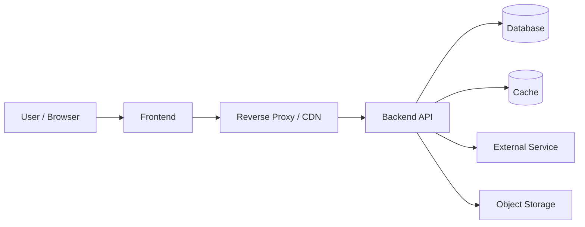

# 시스템 아키텍처

## 1. 아키텍처 개요
- 시스템 목적:
- 클라이언트 종류:
- 서버 애플리케이션:
- 데이터 저장소:
- 캐시 사용 여부:
- 파일 저장소:
- 외부 연동:

## 2. 주요 구성요소
| 구성요소 | 기술 | 역할 | 주요 입출력 | 비고 |
|---|---|---|---|---|
|  |  |  |  |  |

## 3. 요청 흐름
1. 사용자가 클라이언트에서 기능을 실행한다.
2. 프론트엔드가 입력 검증 후 API 요청을 보낸다.
3. 백엔드가 인증, 인가, 비즈니스 로직을 처리한다.
4. 필요한 저장소/외부 시스템과 통신한다.
5. 응답을 반환하고 프론트엔드가 화면 상태를 갱신한다.

## 4. 인증 흐름
> 상세 정책은 `인증 / 인가 설계서.md`에서 다룬다.

- 인증이 필요한 요청의 진입 지점:
- 인증 검증 위치:
- 권한 검사 위치:
- 인증 실패 시 공통 처리:

## 5. 데이터 흐름
### 조회
- 

### 생성 / 수정 / 삭제
- 

### 파일 업로드 / 외부 연동
- 

## 6. 성능 / 확장 고려
- 병목 후보:
- 캐시 적용 후보:
- scale out 지점:
- 비동기 처리 후보:
- 관측성(log / metric / trace) 메모:

## 7. 외부 연동
| 연동 대상 | 목적 | 실패 영향 | fallback / 비고 |
|---|---|---|---|
|  |  |  |  |

## 8. 핵심 아키텍처 판단
### 설계 선택 1
- 선택한 구조:
- 선택 이유:
- 검토한 대안:
- 대안을 배제한 이유:
- 트레이드오프:
- 비용/운영/확장성 영향:

### 설계 선택 2
- 선택한 구조:
- 선택 이유:
- 검토한 대안:
- 대안을 배제한 이유:
- 트레이드오프:
- 비용/운영/확장성 영향:

## 9. 아키텍처 다이어그램(권장)
> 시스템 아키텍처는 시각 자료의 설명력이 크므로 Mermaid를 권장한다.

## 10. 면접 / 포트폴리오 포인트
- 왜 이 구성으로 나눴는가:
- 어떤 병목을 예상했는가:
- 운영/비용 측면에서 타협한 부분:
- 이후 확장 시 바꿔야 할 부분:

## 11. 미확정 사항
- 
- 
